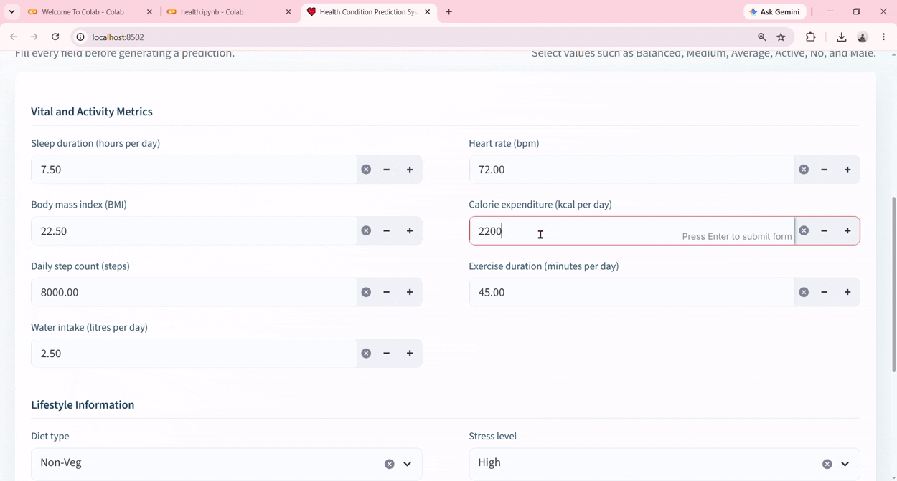

# 🩺 Health Condition Prediction System

### An End-to-End Machine Learning Project for Predicting Health Conditions using Scikit-learn and Streamlit

<p align="center">
  
</p>

<p align="center">


</p>

---

# 📌 Project Overview

The **Health Condition Prediction System** is an end-to-end Machine Learning application designed to classify an individual's health status into one of three categories:

- 🟢 Fit
- 🟡 At-Risk
- 🔴 Unhealthy

The project demonstrates the complete machine learning lifecycle, including data preprocessing, exploratory data analysis (EDA), feature engineering, model training, evaluation, and deployment using **Streamlit**.

A user can enter health-related information through an interactive web interface, and the trained model predicts the individual's health condition instantly.

---

# 🎯 Objective

The primary objective of this project is to build an intelligent prediction system that analyzes multiple health-related attributes and predicts the overall health condition of an individual.

This project also demonstrates how machine learning models can assist healthcare professionals by providing quick preliminary assessments based on historical data.

---

# ✨ Features

## 🤖 Machine Learning

- Complete End-to-End ML Pipeline
- Data Cleaning
- Missing Value Handling
- Outlier Detection & Treatment
- Label Encoding
- Feature Scaling using StandardScaler
- Multiple Model Training
- Random Forest Classifier
- Model Serialization using Pickle

---

## 🌐 Streamlit Web Application

- Interactive User Interface
- Instant Prediction
- Responsive Design
- User-Friendly Layout
- Fast Prediction
- Cached Model Loading

---

# 🎥 Project Demo

<p align="center">

</p>

---

# 📸 Application Screenshots

| Home Page | Prediction |
|-----------|------------|
|  |  |

---

# 📚 Machine Learning Theory

Machine Learning is a branch of Artificial Intelligence that enables computers to learn patterns from historical data and make predictions without being explicitly programmed.

This project follows a supervised learning approach because the dataset contains labeled health conditions.

The workflow includes data preprocessing, feature engineering, model training, evaluation, and deployment.

---

# 🏗️ System Architecture

```text
                    Health Dataset
                           │
                           ▼
                 Data Collection
                           │
                           ▼
                Data Preprocessing
                           │
        ┌──────────────────┴──────────────────┐
        ▼                                     ▼
 Missing Value Handling               Outlier Treatment
        │                                     │
        └──────────────────┬──────────────────┘
                           ▼
                  Feature Engineering
                           │
                           ▼
                   Label Encoding
                           │
                           ▼
                  Feature Scaling
                 (StandardScaler)
                           │
                           ▼
                  Train-Test Split
                           │
                           ▼
              Multiple ML Algorithms
                           │
      ┌──────────┬────────────┬─────────────┐
      ▼          ▼            ▼
 Logistic   Decision Tree  Random Forest
 Regression
                           │
                           ▼
             Best Model Selection
          (Random Forest Classifier)
                           │
                           ▼
               model.pkl + scaler.pkl
                           │
                           ▼
              Streamlit Web Application
                           │
                           ▼
              Health Condition Prediction
```

---

# 🔄 Machine Learning Pipeline

```text
Dataset
   │
   ▼
EDA
   │
   ▼
Data Cleaning
   │
   ▼
Missing Value Handling
   │
   ▼
Outlier Treatment
   │
   ▼
Feature Engineering
   │
   ▼
Encoding
   │
   ▼
Feature Scaling
   │
   ▼
Train/Test Split
   │
   ▼
Model Training
   │
   ▼
Model Evaluation
   │
   ▼
Random Forest Selected
   │
   ▼
Model Saving
   │
   ▼
Streamlit Deployment
```

---

# 📊 Data Preprocessing

Data preprocessing is one of the most important steps in machine learning because raw data often contains inconsistencies that reduce model performance.

The preprocessing steps performed in this project include:

- Handling Missing Values
- Removing Duplicate Records
- Outlier Detection using IQR
- Encoding Categorical Features
- Feature Scaling
- Data Validation

---

# 🌳 Why Random Forest?

Random Forest is an ensemble learning algorithm that combines multiple Decision Trees.

Advantages:

- High Accuracy
- Handles Large Datasets
- Reduces Overfitting
- Robust to Noise
- Works with Numerical & Categorical Features
- Excellent Generalization Performance

---

# 🛠️ Tech Stack

| Category | Technology |
|----------|------------|
| Programming Language | Python |
| Frontend | Streamlit |
| Machine Learning | Scikit-learn |
| Data Processing | Pandas |
| Numerical Computing | NumPy |
| Visualization | Matplotlib, Seaborn |
| Feature Scaling | StandardScaler |
| Model | Random Forest |
| Model Storage | Pickle |

---

# 📂 Dataset

The dataset contains various health-related attributes used to predict the overall health condition.

### Target Classes

- Fit
- At-Risk
- Unhealthy

The dataset includes demographic, lifestyle, and health-related features that influence the prediction.

---

# 📁 Project Structure

```text
Health-Condition-Prediction/
│
├── app.py
├── health.ipynb
├── model.pkl
├── scaler.pkl
├── requirements.txt
├── README.md
│
├── images/
│   ├── home.png
│   └── prediction.png
│
└── recommendation.gif
```

---

# ⚙️ Installation

Clone the repository

```bash
git clone https://github.com/yourusername/health-condition-prediction.git
```

Navigate to the project

```bash
cd health-condition-prediction
```

Install dependencies

```bash
pip install -r requirements.txt
```

Run the Streamlit application

```bash
streamlit run app.py
```

---

# 🚀 How to Use

1. Open the Streamlit application.
2. Enter all required health parameters.
3. Click the **Predict** button.
4. The model processes the input.
5. The predicted health condition is displayed instantly.

---

# 📈 Future Improvements

- Hyperparameter Optimization
- XGBoost Implementation
- LightGBM Integration
- Deep Learning Model
- Explainable AI (SHAP)
- Cloud Deployment
- User Authentication
- PDF Report Generation
- Real-Time Health Monitoring

---

# 🤝 Contributing

Contributions are welcome!

1. Fork the repository.
2. Create a feature branch.
3. Commit your changes.
4. Push your branch.
5. Open a Pull Request.

---

# 📜 License

This project is licensed under the MIT License.

---


# ⭐ Support

If you found this project helpful, please give it a ⭐ on GitHub.

Your support motivates me to build more high-quality Machine Learning projects.
